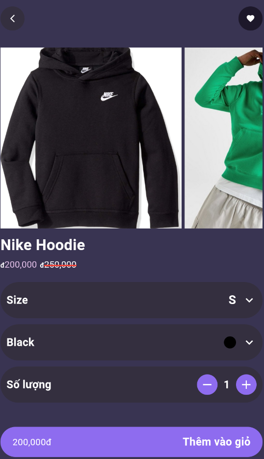
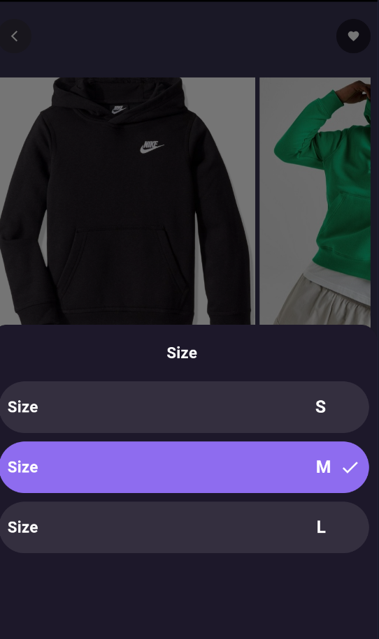
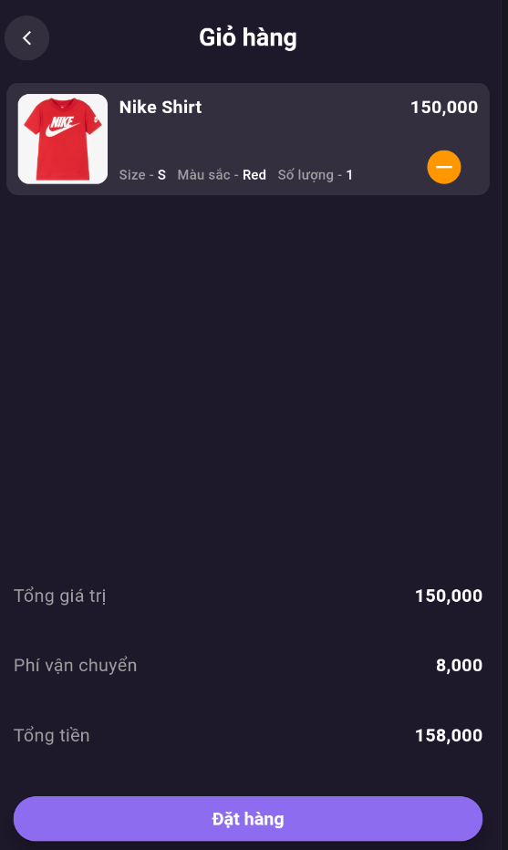

Ứng dụng **Flutter_Fashion_Store** được xây dựng bằng **Flutter** nhằm cung cấp trải nghiệm mua sắm trực tuyến đơn giản và tiện lợi.  

## 🛠 Công nghệ sử dụng
- **Kiến trúc**: Clean Architecture - tổ chức code rõ ràng, dễ bảo trì và mở rộng.  
- **Quản lý trạng thái**: Cubit - đơn giản hóa quản lý trạng thái ứng dụng.  
- **Cơ sở dữ liệu**: Firebase - lưu trữ và đồng bộ dữ liệu theo thời gian thực.  

## 🌟 Tính năng chính
- Duyệt danh mục sản phẩm.
- Thêm sản phẩm vào giỏ hàng.
- Quản lý đơn hàng.
- Xem thông tin sản phẩm chi tiết.

## 📂 Cấu trúc dự án
- **`data`**: Kết nối với Firebase và xử lý dữ liệu.  
- **`domain`**: Định nghĩa logic và các use case.  
- **`presentation`**: Hiển thị UI và quản lý trạng thái bằng Cubit.

## 🖼 Hình ảnh giao diện
## 🖼 Hình ảnh giao diện
| Màn hình chính      | Màn hình chi tiết sản phẩm |
|---------------------|---------------------------|
|  |  |

| Màn hình chọn kích thước | Màn hình chọn màu sắc |
|--------------------------|-----------------------|
|  |  |

| Màn hình giỏ hàng   | Màn hình tìm kiếm |
|---------------------|-------------------|
|  |  |
